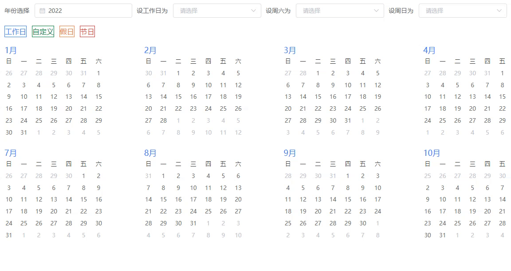

# vue-frame-selection

> vue2 version of the frame selection component

- [vue-frame-selection](#vue-frame-selection)
  - [Preview](#preview)
  - [Usage](#usage)
  - [Props](#props)
    - [FrameSelectionGroup](#frameselectiongroup)
      - [Slot](#slot)
    - [FrameSelectionItem](#frameselectionitem)
      - [Slot](#slot-1)
  - [APIs](#apis)
    - [FrameSelectionGroup](#frameselectiongroup-1)
      - [getInnerBoxRectList](#getinnerboxrectlist)
      - [isInTheSelection](#isintheselection)

## Preview



## Usage

```sh
npm i vue-frame-selection
# or
yarn add vue-frame-selection
```

```ts
// demo.vue
import {
  // wrap group
  FrameSelectionGroup,
  // items
  FrameSelectionItem,
  // inner es6 class
  MouseSelection
} from 'vue-frame-selection'

export default {
  components: {
    FrameSelectionGroup,
    FrameSelectionItem
  }
}
```

```html
<FrameSelectionGroup
  ref="selection"
  @mousedown="onMousedown"
  @mousemove="onMousemove"
  @mouseup="onMouseup"
>
  <FrameSelectionItem v-for="(item, idx) in data" :key="item[valueKey]">
    <template>
      <slot
        :selected="
          !item.disabled && (isInTheBoxList[idx] || checkSelected(idx))
        "
        :item="item"
        :index="idx"
      ></slot>
    </template>
  </FrameSelectionItem>
</FrameSelectionGroup>
```

```js
// you can write your own logic
export default {
  name: 'FrameSelection',
  components: {
    FrameSelectionGroup,
    FrameSelectionItem
  },
  props: {
    data: {
      type: [Array],
      default: () => []
    },
    valueKey: {
      type: [String],
      default: 'id'
    }
  },
  data () {
    return {
      // boolean array
      isInTheBoxList: [],
      // each item's offset (top,left,width,height)
      innerBoxRectList: [],
      // selected item index set
      selectedSet: new Set()
    }
  },
  methods: {
    checkSelected (id) {
      return this.selectedSet.has(id)
    },
    onMousedown () {
      this.isClick = true
      this.innerBoxRectList = this.$refs.selection.getInnerBoxRectList()
    },

    onMousemove () {
      this.isClick = false
      this.inBoxSync()
    },
    onMouseup () {
      if (this.isClick) {
        this.inBoxSync()
      }

      this.isInTheBoxList
        .reduce((acc, cur, idx) => {
          if (cur) {
            acc.push(idx)
          }
          return acc
        }, [])
        .forEach((x) => {
          if (!this.data[x].disabled) {
            this.selectedSet.add(x)
          }
        })

      this.isInTheBoxList = []
      this.isClick = false
    },
    inBoxSync () {
      this.isInTheBoxList = this.innerBoxRectList.map((rect) => {
        return this.$refs.selection.isInTheSelection(rect)
      })
    }
  },
  created () {
    this.isClick = false
  }
}
```

Full features See [`demo`](https://github.com/sonofmagic/universal-vue-library-template/blob/main/apps/vue2/src/components/vue-frame-selection/demo/index.vue)

## Props

### FrameSelectionGroup

| name               | type    | default   | description                                               |
| ------------------ | ------- | --------- | --------------------------------------------------------- |
| className          | String  | undefined | Rectangle Selection customClassName                       |
| scale              | Number  | 1         | if you add css transform  scale you should add this param |
| zIndex             | Number  | 99999999  | Rectangle  zIndex Selection                               |
| disabled           | Boolean | false     | is disabled                                               |
| stopPropagation    | Boolean | false     | whether invoke event.stopPropagation()                    |
| stopSelector       | String  | undefined | _selectStart  at                                          |
| notSetWrapPosition | Boolean | false     | whether add position: relative                            |

#### Slot

| name    | description  |
| ------- | ------------ |
| default | default slot |

### FrameSelectionItem

#### Slot

| name    | description  |
| ------- | ------------ |
| default | default slot |

## APIs

### FrameSelectionGroup

#### getInnerBoxRectList

Get all child `FrameSelectionItem` and get it's offset postition (top,left,width,height)

```js
getInnerBoxRectList () {
  return this.cacheDoms.map((dom) => {
    return {
      left: dom.offsetLeft,
      top: dom.offsetTop,
      width: dom.offsetWidth,
      height: dom.offsetHeight
    }
  })
}
```

#### isInTheSelection

return a boolean array, for check if the item is in the selection.

```js
// rect is {top,left,width,height}
isInTheSelection (rect) {
  if (this.selection) {
    return this.selection.isInTheSelection(rect)
  }
}
```


